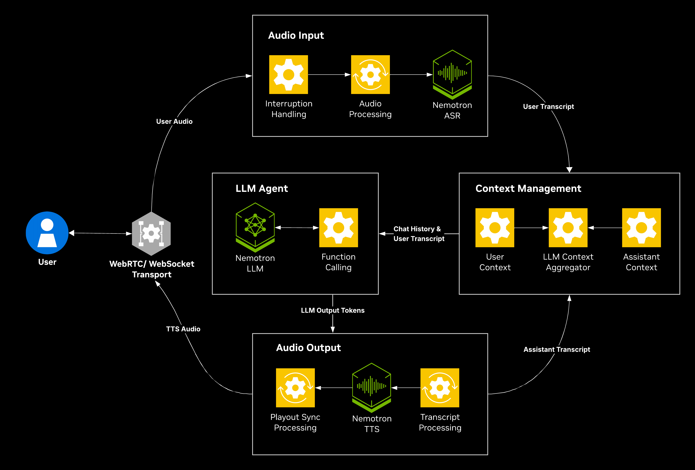

# Nemotron Voice Agent

Nemotron Voice Agent Blueprint provides a comprehensive, end-to-end voice agent built with NVIDIA Nemotron state-of-the-art open models, as NVIDIA NIM for acceleration and scaling. It is designed to guide developers through the creation of a cascaded pipeline, integrating Nemotron ASR, LLM, and TTS, while solving for the complexities of streaming, interruptible conversations. Clone it, swap in your own logic, and deploy a working voice AI prototype in hours.

Built on the open-source [Pipecat framework](https://github.com/pipecat-ai/pipecat) and leveraging NVIDIA NIM microservices, this example helps teams accelerate the deployment of high-performance voice AI solutions.

## Why this blueprint

- **Sub-second E2E latency**: sub-second end-to-end latency with support for multiple concurrent streams, designed for production scale.
- **Fully open models**: Nemotron Streaming and Parakeet ASR, Magpie TTS and Nemotron LLM models. Swap any component, self-host, no lock-in.
- **Interruption Handling**: Voice Activity Detection (VAD) and End-of-Utterance (EOU) logic to guide the agent on exactly when to start and stop speaking, ensuring a natural conversational flow.
- **Multilingual Capabilities**: native support for multiple languages provided by NVIDIA Magpie TTS and Multilingual ASR.
- **Multimodal Understanding**: reason over speech and vision together, analyzing live camera input and uploaded media (images, documents) within a single conversation, powered by Nemotron Omni.
- **Multi-Agent and Tool Calling**: orchestrate cooperating agents that invoke external tools and functions for task-oriented workflows, while decoupling reasoning from response generation for lower perceived latency.
- **Edge Support**: deploy anywhere, from cloud and workstation to DGX Spark and edge devices like Jetson Thor, using self-contained deployment recipes.

---

## Architecture



---

## Models and Services

| Component | Model | Swap with |
|-----------|-------|-----------|
| **ASR** | [Nemotron ASR Streaming](https://build.nvidia.com/nvidia/nemotron-asr-streaming/modelcard) | Any NIM ASR |
| | [Parakeet CTC 1.1B ASR](https://build.nvidia.com/nvidia/parakeet-ctc-1_1b-asr/modelcard) | |
| | [Parakeet 1.1B RNNT Multilingual ASR](https://build.nvidia.com/nvidia/parakeet-1_1b-rnnt-multilingual-asr/modelcard) | |
| **TTS** | [Magpie TTS Multilingual](https://build.nvidia.com/nvidia/magpie-tts-multilingual/modelcard) | Any NIM TTS |
| **LLM** | [Nemotron 3 Nano 30B A3B](https://build.nvidia.com/nvidia/nemotron-3-nano-30b-a3b/modelcard) | Any OpenAI-compatible |
| | [Nemotron 3 Super 120B A12B](https://build.nvidia.com/nvidia/nemotron-3-super-120b-a12b/modelcard) | |
| | [Nemotron 3 Nano Omni 30B A3B](https://build.nvidia.com/nvidia/nemotron-3-nano-omni-30b-a3b-reasoning) | |
| **Orchestration** | [Pipecat](https://github.com/pipecat-ai/pipecat) | [LiveKit Agents with NVIDIA plugin](https://github.com/livekit/agents/tree/main/livekit-plugins/livekit-plugins-nvidia) |

---

## Examples

Each example showcases a **pattern** for building a voice pipeline. Start from the one closest to your use case and adapt it. Follow each example's own README (linked below) for its architecture, supported recipes, configuration, and tunables.

| Example | Description | When to use | Supported Deployment Profiles |
|---------|-------------|-------------|--------------------|
| [Generic Assistant](src/examples/generic/README.md) | Baseline **English-only** cascaded pipeline with Nemotron ASR, Nemotron LLM, and Magpie TTS. | Best for getting started and prototyping, before tailoring to a specific domain. | Cloud, Workstation, DGX Spark, Jetson Thor |
| [Multilingual Assistant](src/examples/multilingual/README.md) | Cascaded pipeline using **Multilingual ASR and TTS**, with a fixed language per session for better reliability. | Use for non-English and multi-language voice agents. | Cloud, Workstation, DGX Spark |
| [Nemotron Omni Assistant](src/examples/omni_assistant/README.md) | Cascaded pipeline using **Nemotron Omni**, where a single model replaces the ASR + LLM stages and Magpie TTS speaks the reply. | Comparing a cascaded ASR + LLM + TTS pipeline against an Omni-based one. | Cloud, Workstation, DGX Spark, Jetson Thor |
| [Nemotron Omni Assistant Subagents](src/examples/omni_assistant_subagents/README.md) | Multi-agent **Nemotron Omni** pipeline where specialized agents add audio/video and live-webcam understanding while the voice loop stays responsive. | Recommended for multimodal inputs, giving a richer experience across image, audio, video, and webcam. | Cloud, Workstation, DGX Spark |
| [Frontend/Backend Agent](src/examples/frontend_backend_agent/README.md) | A fast frontend LLM handles the conversation while a specialized backend agent does the work. This is the pattern for giving an **existing text / agentic backend** a real-time conversational experience (the flight-booking agent as the reference backend). | Add voice to an existing text agent / agentic backend with minimal changes. | Cloud, Workstation |

> **Note:** The listed deployment profiles are what ship in the default configs, not a hard limit. The example can be extended to other profiles (different hardware or models). Those just aren't included out of the box.

---

## Requirements

These are the minimum requirements, and support varies by example and deployment profile. See the [Examples](#examples) table for what runs where, and each example's README plus the [LLM](docs/how-to/configure-llm.md) / [ASR](docs/how-to/configure-asr.md) / [TTS](docs/how-to/configure-tts.md) Services docs for exact models and corresponding VRAM usage.

### Hardware Requirements

| Deployment Profile | Hardware | Notes |
|------|----------|-------|
| Cloud | CPU only (no GPU) | Model endpoints from NVIDIA cloud APIs (NVCF). |
| Workstation | Single GPU ≥ 72 GB, or 2 GPUs ≥ 40 GB each | Assuming FP8/NVFP4 weights for LLM models. On A100/Ampere or older, switch to the BF16 profile and will need more VRAM. |
| DGX Spark | 1 GPU, 128 GB unified memory (Blackwell) | Using NVFP4 LLM models |
| Jetson Thor | 1 GPU, 128 GB unified memory (Blackwell) | Edge deployment. Follow the [Jetson Thor guide](docs/03-jetson-thor.md) for deployment. |

### Software Requirements

- **NVIDIA NGC**: Valid credentials for NVIDIA NGC. See the [NGC Getting Started Guide](https://docs.nvidia.com/ngc/ngc-overview/index.html#registering-activating-ngc-account).
- **NVIDIA API Key**: Required for NVIDIA NIM models and NGC container images. Get yours at [build.nvidia.com](https://build.nvidia.com/).
- **Docker**: With NVIDIA GPU support installed and Docker Compose v2.20 or newer.

---

## Quick Start

Deploy with the bundled **agent skills** (recommended), or follow the manual steps below. In below steps, we deploy the **Generic Assistant on a workstation GPU**. For other examples or deployment profiles, see the [Examples](#examples) table and each example's README. For a Jetson quickstart, follow the [Jetson Thor guide](docs/03-jetson-thor.md).

### With the agent skills

Install the skills, then ask your coding agent to deploy or configure your chosen example:

```bash
npx skills add .
```

### Manual steps

1. Clone the repository and navigate to the root directory and copy the example environment file [.env.example](.env.example) to the root directory.

    ```bash
    git clone git@github.com:NVIDIA-AI-Blueprints/nemotron-voice-agent.git
    cd nemotron-voice-agent
    cp .env.example .env
    ```

2. Set your NVIDIA API key as an environment variable:

    ```bash
    export NVIDIA_API_KEY=<your-nvidia-api-key>
    ```

3. Login to NVIDIA NGC Docker Registry.

    ```bash
    printf '%s' "$NVIDIA_API_KEY" | docker login nvcr.io -u '$oauthtoken' --password-stdin
    ```

4. Deploy the Generic Assistant on a local workstation GPU (minimum 72 GB VRAM):

    ```bash
    docker compose --profile generic-assistant/workstation up -d
    ```

    > **Note:** Deployment may take 30-60 minutes on first run. This runs the Generic Cascaded pipeline with local NIM ASR, LLM, and TTS sidecars. On local recipes, the **first voice interaction** may have higher latency while GPU sidecars warm up. Later turns are much faster. If no local GPU or not enough VRAM available, run the cloud profile `--profile generic-assistant` instead.

5. Access the application at `https://<machine-ip>:7860`. Keep TLS enabled when testing the browser UI.

    - **TLS:** HTTPS is the default, because browser microphone and WebRTC require a secure context. `PIPELINE_TLS=false` serves plain HTTP for headless/API testing. See [plain-HTTP deployment and usage](docs/06-troubleshooting.md#browser-access) in Troubleshooting.
    - **Remote access:** clients on a different network may need a TURN server. See [Enable a TURN Server](docs/how-to/enable-turn-server.md).
    - **Audio:** use a headset (preferably wired) for the best experience.

For detailed setup instructions, see the [Getting Started Guide](docs/01-getting-started.md). For common startup issues, see [Troubleshooting](docs/06-troubleshooting.md).

---

## Agent Skills

This repository includes AI agent skills for deployment assistance. Install them for your coding agent with:

```bash
npx skills add .
```

- [`deploy`](skills/deploy/SKILL.md): NGC login, deployment-profile selection, and compose bring-up.
- [`configure-pipeline`](skills/configure-pipeline/SKILL.md): edit `.env`, prompts, and example service catalogs, then re-apply the change.

---

## Documentation

| Type | Guide | Description |
|------|-------|-------------|
| Tutorial | [Getting Started](docs/01-getting-started.md) | Full deployment: quick start, local GPU, DGX Spark, and the recipe matrix |
| How-to | [Configuration Guide](docs/02-configuration-guide.md) | Index of all configuration and customization guides |
| Reference | [LLM](docs/how-to/configure-llm.md) · [ASR](docs/how-to/configure-asr.md) · [TTS](docs/how-to/configure-tts.md) Models | NVIDIA model catalogs, VRAM usage and model configs |
| How-to | [Jetson Thor](docs/03-jetson-thor.md) | Edge deployment guide |
| Reference | [Evaluation & Performance](docs/04-evaluation-and-performance.md) | Accuracy and latency/scaling benchmarks |
| Explanation | [Best Practices](docs/05-best-practices.md) | Production latency, UX, and scaling guidance |
| How-to | [Troubleshooting](docs/06-troubleshooting.md) | Startup & deployment known issues |

Step-by-step **how-to guides** are indexed in the [Configuration Guide](docs/02-configuration-guide.md). They cover configuring .env, models, and prompts, and enabling opentelemetry tracing, a TURN Server, and the audio recorder for debugging.

---

## Roadmap

**Future releases**
- Fully open model support via HuggingFace and NeMo (no NIM required).
- LiveKit Agents-based sample example.
- Voice Agent skill for iterative development with AI coding agents.

**v2.0.0** (July 2026)
- Omni-based example showcasing a single multimodal model replacing the ASR + LLM stages.
- Omni subagents example demonstrating multi-agent coordination for audio and video understanding.
- Frontend/backend agent example showing how to integrate an existing text-based agentic backend with a voice frontend.
- New models: Nemotron 3 Super 120B A12B, Nemotron 3 Nano Omni, Nemotron ASR Streaming (English + Multilingual).

**v1.0.0** (March 2026)
- Generic cascaded pipeline (Parakeet ASR + LLM + Magpie TTS) with English and multilingual support.

See [CHANGELOG](CHANGELOG.md) for the full release history.

---

## License

This NVIDIA AI BLUEPRINT is licensed under the BSD 2-Clause License. See [LICENSE](LICENSE) for details. This project may download and install additional third-party open source software and containers. Review the license terms of these projects in [third_party_oss_license.txt](third_party_oss_license.txt) before use.
