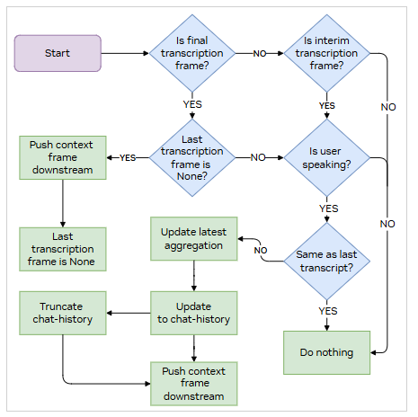

# Speculative Speech Processing

Speculative speech processing reduces response latency by processing interim ASR transcripts before the user finishes speaking. This feature is enabled by default and provides approximately **300ms reduction** in end-to-end latency.

---

## Configuration

Speculative speech processing is controlled by the `ENABLE_SPECULATIVE_SPEECH` environment variable in [.env](../config/env.example).

```bash
# Enable speculative speech processing (default)
ENABLE_SPECULATIVE_SPEECH=true

# Or disable speculative speech processing
ENABLE_SPECULATIVE_SPEECH=false
```

**Note:** This feature only works with Nemotron Speech ASR.

---

## Benefits

When enabled, speculative speech processing provides:

| Benefit | Description |
|---------|-------------|
| **Lower latency** | ~300ms reduction by starting response generation before user finishes speaking |
| **Natural conversation flow** | TTS responses are cached and released at appropriate times |
| **Parallel processing** | LLM and TTS services process interim transcripts while user continues speaking |

---

## How It Works

1. **User speaks**: ASR generates interim transcripts with stability scores as audio is processed.
2. **Stable interims processed**: Transcripts with stability=1.0 are sent to LLM for early response generation.
3. **Responses cached**: TTS outputs are buffered while the user is still speaking.
4. **User stops speaking**: Cached responses are released, providing faster perceived response time.
5. **Final transcript arrives**: If different from interims, the response is updated.



---

## Key Components

The following NVIDIA Pipecat components enable speculative speech processing. For more details, see the [NVIDIA Pipecat documentation](./07-nvidia-pipecat.md).

| Component | Purpose |
|-----------|---------|
| `NvidiaUserContextAggregator` | Filters stable interim transcripts and manages conversation context |
| `NvidiaAssistantContextAggregator` | Updates responses as context changes and prevents overlapping turns |
| `NvidiaTTSResponseCacher` | Buffers TTS responses during user speech and coordinates release timing |

---

## Pipeline Configuration

When speculative speech is enabled, the agent's pipeline includes the TTS response cacher:

```python
pipeline = Pipeline([
    transport.input(),
    stt,                                    # NemotronASRService
    context_aggregator.user(),              # Filters interim transcripts
    llm,
    tts,
    tts_response_cacher,                    # Caches responses during user speech
    transport.output(),
    context_aggregator.assistant()
])
```

When disabled, the response cacher is removed and only final transcripts are processed.

---

## Advanced: Building Custom Frame Processors

When developing components that work with speculative speech processing, follow these guidelines:

**Handle Interim States:**
- Design frames to carry stability information.
- Include mechanisms to update or replace interim content.
- Implement clear state transitions from interim to final.

**Design for Incremental Updates:**
- Support partial response processing and cancellation.
- Handle transitions between interim and final states.
- Consider that `TTSRawAudio` frames are cached until release conditions are triggered.

---

## Technical Foundation

This implementation builds on NVIDIA Nemotron Speech ASR's Two-Pass End of Utterance mechanism:

- Real-time interim transcript generation with stability metrics
- Hypothesis refinement as more audio is processed
- Clear signaling of final transcripts

For more details, see the [NVIDIA Nemotron Speech ASR documentation](https://docs.nvidia.com/deeplearning/riva/user-guide/docs/asr/asr-overview.html#two-pass-end-of-utterance).
