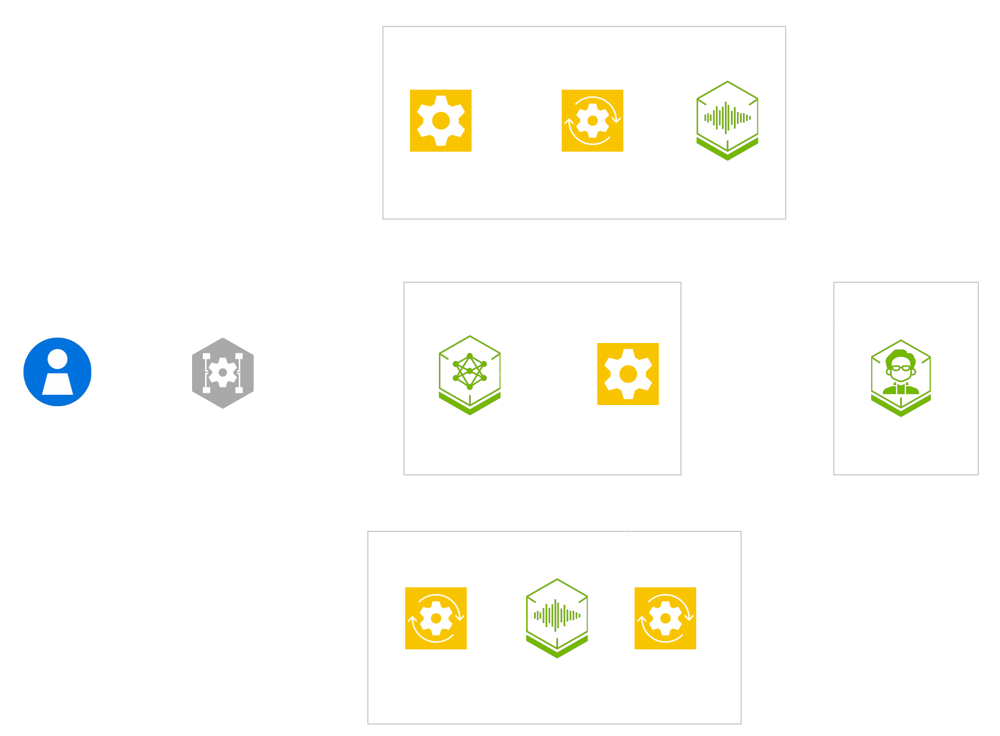

# Frontend/Backend Agent Cascaded Example

Cascaded voice agent example showcasing the Frontend/Backend Agent design for flight-booking. It is a stateful airline support agent that separates fast user-facing speech from slower planning and tool work for flight search, booking, PNR status, rebooking, cancellation, and standby flows.

The frontend LLM is the only user-facing LLM and exposes `call_backend` plus `cancel_backend` as internal delegation tools. The backend agent is scoped to each conversation and owns flight search, selected-flight booking, PNR status, lifecycle markers, and abort state. In the running pipeline it talks to the booking-server sidecar in `airline/database` over HTTP as its backend database.

The airline backend agent is the reference backend, but the architecture is reusable: treat the frontend LLM as a generic conversational layer in front of another backend agent that exposes compatible call/cancel behavior. Booking is intentionally gated, so the user must search flights first and select one returned flight before the backend agent can continue booking.



The diagram shows the full runtime path. User audio enters through the WebRTC/WebSocket transport, audio input processing produces a user transcript for the frontend LLM, the frontend LLM sends rephrased task requirements to the backend agent, and backend results return to the frontend LLM before audio output is synthesized and played back.

## Running the example

See the [Getting Started guide](../../../docs/01-getting-started.md) for prerequisites and hardware detail. Run every command from the repository root.

1. Create your `.env` from the template and set your NVIDIA API key:

   ```bash
   cp .env.example .env
   export NVIDIA_API_KEY=<your-nvidia-api-key>
   ```

2. Log in to the NVIDIA NGC container registry:

   ```bash
   printf '%s' "$NVIDIA_API_KEY" | docker login nvcr.io -u '$oauthtoken' --password-stdin
   ```

3. Deploy the profile that matches your hardware:

   ```bash
   docker compose --profile frontend-backend-agent up -d              # Cloud ASR, LLM, TTS + booking-server
   docker compose --profile frontend-backend-agent/workstation up -d  # Local NIM ASR, TTS, LLM + booking-server
   ```

   | Recipe profile | App service | Sidecars |
   | --- | --- | --- |
   | `frontend-backend-agent` | `frontend-backend-agent` | `booking-server` |
   | `frontend-backend-agent/workstation` | `frontend-backend-agent` | `booking-server`, `nvidia-llm`, `nemotron-asr-streaming-english`, `tts-service` |

4. Open the UI at `https://localhost:7860/`. Keep TLS enabled for browser UI testing. `PIPELINE_TLS=false` serves plain HTTP for headless performance and API testing. For plain-HTTP browser testing, see [browser access](../../../docs/06-troubleshooting.md#browser-access).

5. Clean up when you are done by tearing down with the same profile you started with:

   ```bash
   docker compose --profile frontend-backend-agent down              # Cloud
   docker compose --profile frontend-backend-agent/workstation down  # Workstation
   ```

To run host-native without Docker, set `selection: frontend-backend-agent` in [`examples_registry.yaml`](../../../examples_registry.yaml). Start the booking server in one shell:

```bash
PYTHONPATH=src uv run python3 -m examples.frontend_backend_agent.airline.database.server
```

Then start the UI server in another shell:

```bash
uv run python3 src/server.py
```

## Customization

Reusable Frontend/Backend Agent helpers live under `src/`, airline flight-booking domain logic lives under `airline/`, and the booking-server sidecar in `airline/database` is the backend database for Docker runs.


| Env var | Default | Purpose |
| --- | --- | --- |
| `CHAT_HISTORY_RECENT_TURNS` | `20` | Number of recent non-prompt messages retained in the frontend LLM context window |
| `THINKER_FILLER_THRESHOLD_SECONDS` | `0.3` | Delay before optional `call_backend.filler_text` is spoken while backend work is still running |
| `THINKER_TOOL_TIMEOUT_SECONDS` | `30.0` | Timeout for `call_backend` / `cancel_backend` tool handlers |

For model, prompt, and catalog configuration, see [Configure LLM](../../../docs/how-to/configure-llm.md), [Configure Prompts](../../../docs/how-to/configure-prompts.md), and [Configure Services](../../../docs/how-to/configure-services.md). For deployment and general failure modes, see the [Troubleshooting guide](../../../docs/06-troubleshooting.md).

## Tips & best practices

### Preserve the frontend/backend split

The frontend LLM is the only user-facing component. For flight-task turns, it should call `call_backend` or `cancel_backend`. It should not ask booking-specific missing-field questions, summarize pending flight work, or expose tools. The backend agent owns domain planning, slot extraction, backend calls, booking state, policy checks, and final task responses.

### Send self-contained backend requests

Each `call_backend` query should describe the complete current request using the latest user turn plus relevant prior context. Avoid delta-only requests like "change the previous booking." The latest correction should override older context.

### Treat cancellation as a required path

Use `cancel_backend` when the user says to stop, cancel, abandon, ignore, or never mind pending flight work. Also use it when the user switches to unrelated small talk or a non-flight topic while flight work may still be pending. This prevents stale backend results from reaching the user later.

### Re-test tool-calling accuracy after prompt changes

Prompt edits can silently break the architecture contract. After changing the frontend or backend prompts, test both routing layers:

- Frontend LLM calls `call_backend` for flight search, booking continuation, flight selection, passenger details, seat or meal preferences, confirmations, corrections, and PNR-status requests.
- Frontend LLM calls `cancel_backend` for stop, cancel, never-mind requests, and topic switches while flight work is pending.
- Frontend LLM does not call tools for greetings, thanks, or small talk when no flight task is pending.
- Backend agent calls `flight_search` only when required route and date details are available.
- Backend agent calls `booking` only after a searched flight has been selected.
- Backend agent calls `pnr_status` for PNR, record-locator, or booking-status requests.
- Backend agent returns `response_hint` for missing information or unsupported requests instead of inventing backend results.
