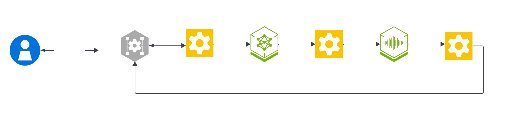

# Nemotron Omni Assistant - cascaded pipeline example

Cascaded voice pipeline that uses Nemotron 3 Nano Omni as a single model for ASR and the LLM, then hands the text reply to Magpie TTS. Nemotron Omni consumes user audio directly and produces the assistant text that Magpie TTS speaks. This example enables only text and audio inputs. Uploaded media and webcam vision are covered by [`omni-assistant-subagents`](../omni_assistant_subagents/README.md).

The pattern replaces the separate ASR and text LLM stages with one audio-input LLM service while preserving the familiar Pipecat transport, TTS, prompt, and service-catalog flow. It showcases `NvidiaOmniMultimodalService`, audio-only turn finalization, and a user transcript taken from the Omni response rather than a separate ASR pipeline.



## Running the example

This example runs on every deployment profile: **Cloud** (no local GPU, NVCF endpoints), **Workstation** (single GPU), **DGX Spark** (Blackwell, 128 GB unified memory), and **Jetson Thor** (edge). See the [Getting Started guide](../../../docs/01-getting-started.md) for prerequisites and hardware detail. Run every command from the repository root.

1. Create your `.env` from the template and set your NVIDIA API key:

   ```bash
   cp .env.example .env
   export NVIDIA_API_KEY=<your-nvidia-api-key>
   ```

   > **Local profiles (Workstation, DGX Spark, Jetson Thor):** also set `HF_TOKEN` in `.env`. Omni is served with vLLM, which downloads the model weights from Hugging Face.

2. Log in to the NVIDIA NGC container registry:

   ```bash
   printf '%s' "$NVIDIA_API_KEY" | docker login nvcr.io -u '$oauthtoken' --password-stdin
   ```

3. Deploy the profile that matches your hardware:

   ```bash
   docker compose --profile omni-assistant up -d              # Cloud (no local GPU)
   docker compose --profile omni-assistant/workstation up -d  # Workstation
   docker compose --profile omni-assistant/dgx-spark up -d    # DGX Spark
   docker compose --profile omni-assistant/jetson-thor up -d  # Jetson Thor
   ```

   | Recipe profile | App service | Shared sidecars pulled from `docker/` |
   | --- | --- | --- |
   | `omni-assistant` | `omni-assistant` | none (cloud NVCF) |
   | `omni-assistant/workstation` | `omni-assistant` | `nvidia-llm-vllm-omni`, `tts-service` |
   | `omni-assistant/dgx-spark` | `omni-assistant` | `nvidia-llm-vllm-omni`, `tts-service` |
   | `omni-assistant/jetson-thor` | `omni-assistant` | `nvidia-llm-vllm-omni`, `nemotron-speech-tts` (Riva TTS) |

   > Jetson Thor (128 GB unified memory) fits the 30B Omni NVFP4 model and reuses the same Omni vLLM sidecar, with TTS served by the on-device Riva `nemotron-speech-tts` service instead of the Magpie NIM. It needs a one-time Riva model build first, so follow the [Jetson Thor guide](../../../docs/03-jetson-thor.md). Orin-class Jetson hardware is not supported because the models does not fit.

4. Open the UI at `https://localhost:7860/`. Keep TLS enabled for browser UI testing. `PIPELINE_TLS=false` serves plain HTTP for headless performance and API testing. For plain-HTTP browser testing, see [browser access](../../../docs/06-troubleshooting.md#browser-access).

5. Clean up when you are done by tearing down with the same profile you started with:

   ```bash
   docker compose --profile omni-assistant/workstation down
   ```

To run host-native without Docker, set `selection: omni-assistant` in [`examples_registry.yaml`](../../../examples_registry.yaml), then run `uv run python3 src/server.py`.

## Customization

| Path | Role |
| --- | --- |
| `pipeline.py` | pipecat entry point for the Omni Assistant example |
| `nvidia_omni_multimodal_service.py` | `NvidiaOmniMultimodalService` (upstream-shaped Pipecat `LLMService` for Nemotron Omni) |
| `audio_only_smart_turn_strategy.py` | smart-turn stop strategy that finalizes turns without an upstream `TranscriptionFrame` |
| `prompts.yaml` | example-local prompt catalog |
| `services.cloud.yaml`, `services.local.yaml` | example-local service catalogs for cloud and on-prem deployments |

Environment variables read by [`pipeline.py`](pipeline.py):

| Env var | Default | Purpose |
| --- | --- | --- |
| `OMNI_MAX_TOKENS` | `8192` | Max tokens for the Omni response |
| `OMNI_TEMPERATURE` | `0.6` | Sampling temperature |
| `OMNI_TOP_P` | `0.95` | Nucleus sampling top-p |
| `OMNI_MIN_USER_AUDIO_SECS` | `0.3` | Drop turns shorter than this |
| `OMNI_EMIT_TRANSCRIPTIONS` | `true` | Parse `{"transcript", "response"}` from the Omni response so the user transcript is recovered |
| `TTS_STOP_FRAME_TIMEOUT_S` | `30` | TTS audio-context idle timeout |
| `AUDIO_OUT_10MS_CHUNKS` | `5` (WebRTC) / `10` (WebSocket) | Outbound audio framing |

For model selection, voices, and shared service-catalog mechanics, see [Configure LLM](../../../docs/how-to/configure-llm.md), [Configure TTS](../../../docs/how-to/configure-tts.md), and [Configure Services](../../../docs/how-to/configure-services.md).

## Tips & best practices

- **Omni model and hardware.** Omni serves the NVFP4 30B model through the `nvidia-llm-vllm-omni` vLLM sidecar, which needs a Blackwell GPU. For older hardware, see the [Hugging Face documentation](https://huggingface.co/nvidia/Nemotron-3-Nano-Omni-30B-A3B-Reasoning-BF16) for deploying with FP8 or BF16 precision.
- **Tune Omni behavior** with the environment variables in the table above: keep user transcript on so the UI shows the user's words, raise the minimum-audio threshold if noise triggers spurious turns, and adjust max-tokens and sampling for your latency and verbosity targets.
- For deployment and general failure modes, see the [Troubleshooting guide](../../../docs/06-troubleshooting.md). VRAM sizing for the Omni vLLM sidecar is covered in [Configure LLM](../../../docs/how-to/configure-llm.md#vram--hardware-support), and edge deployment in the [Jetson Thor guide](../../../docs/03-jetson-thor.md).
