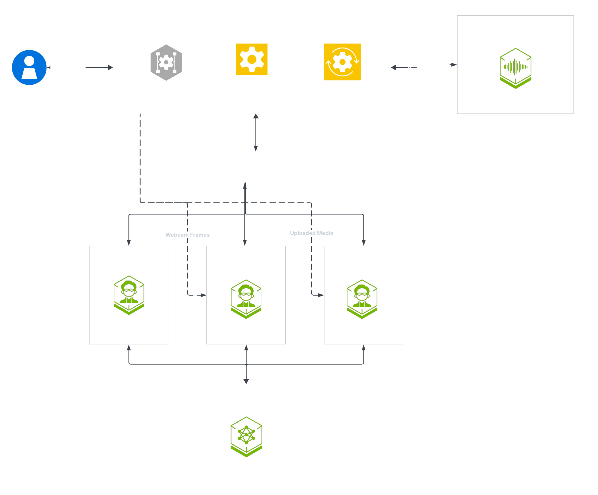

# Nemotron Omni Assistant Subagents - cascaded pipeline example

Multi-agent variant of [`omni-assistant`](../omni_assistant/README.md) built on Pipecat's built-in multi-agent framework (`pipecat.workers`). A transport agent owns I/O and TTS, a speaker agent owns spoken output, and two worker agents handle uploaded media and live webcam vision. It keeps the voice conversation responsive while specialized agents analyze uploaded media and live webcam frames.

The pattern splits responsibility across a transport agent, speaker agent, media analyzer, and webcam agent using `pipecat.workers`, with explicit dispatch and acknowledgement points. It showcases agent boundaries and prompt separation, visual barge-in, deferred media dispatch, rolling webcam scene summaries, and UI capability declarations for attachments and webcam support.



## Running the example

This example runs on the **Cloud** (no local GPU, NVCF endpoints), **Workstation** (single GPU), and **DGX Spark** (Blackwell, 128 GB unified memory) profiles. See the [Getting Started guide](../../../docs/01-getting-started.md) for prerequisites and hardware detail. Run every command from the repository root.

1. Create your `.env` from the template and set your NVIDIA API key:

   ```bash
   cp .env.example .env
   export NVIDIA_API_KEY=<your-nvidia-api-key>
   ```

   > **Local profiles (Workstation, DGX Spark):** also set `HF_TOKEN` in `.env`. Omni is served with vLLM, which downloads the model weights from Hugging Face.

2. Log in to the NVIDIA NGC container registry:

   ```bash
   printf '%s' "$NVIDIA_API_KEY" | docker login nvcr.io -u '$oauthtoken' --password-stdin
   ```

3. Deploy the profile that matches your hardware:

   ```bash
   docker compose --profile omni-assistant-subagents up -d              # Cloud (no local GPU)
   docker compose --profile omni-assistant-subagents/workstation up -d  # Workstation
   docker compose --profile omni-assistant-subagents/dgx-spark up -d    # DGX Spark
   ```

   | Recipe profile | App service | Shared sidecars pulled from `docker/` |
   | --- | --- | --- |
   | `omni-assistant-subagents` | `omni-assistant-subagents` | none (cloud NVCF) |
   | `omni-assistant-subagents/workstation` | `omni-assistant-subagents` | `nvidia-llm-vllm-omni`, `tts-service` |
   | `omni-assistant-subagents/dgx-spark` | `omni-assistant-subagents` | `nvidia-llm-vllm-omni`, `tts-service` |

4. Open the UI at `https://localhost:7860/`. Keep TLS enabled for browser UI testing. `PIPELINE_TLS=false` serves plain HTTP for headless performance and API testing. For plain-HTTP browser testing, see [browser access](../../../docs/06-troubleshooting.md#browser-access).

5. Clean up when you are done by tearing down with the same profile you started with:

   ```bash
   docker compose --profile omni-assistant-subagents/workstation down
   ```

To run host-native without Docker, set `selection: omni-assistant-subagents` in [`examples_registry.yaml`](../../../examples_registry.yaml), then run `uv run python3 src/server.py`.

## Customization

| Path | Role |
| --- | --- |
| `pipeline.py` | entry point that wires the four workers into a `WorkerRunner` over a shared `WorkerBus` |
| `subagents/speaker/agent.py` | `SpeakerOmniAgent` plus a structured-JSON wrapper around `NvidiaOmniMultimodalService` |
| `subagents/transport/agent.py` | `OmniTransportAgent` for transport I/O, TTS, visual barge-in, and analyzer dispatch |
| `subagents/media_analyzer/agent.py` | `MediaAnalyzerWorker` for uploaded image, audio, and video attachments |
| `subagents/webcam/agent.py` | `WebcamAgent` rolling scene summaries for live webcam context |
| `media_dispatch_processor.py` | frame-processor that defers analyzer dispatch until the speaker ack closes |
| `prompts.yaml` | example-local prompt catalog (top-level prompt plus `agent_prompts:` per agent) |
| `services.cloud.yaml`, `services.local.yaml` | example-local service catalogs for cloud and on-prem deployments |

The example declares `capabilities: [attachments, webcam]` in `examples_registry.yaml`, which gates these UI surfaces and backend endpoints:

| Endpoint | Purpose |
| --- | --- |
| `POST /api/sessions/{session_id}/attachments?kind={image,audio,video}` | Upload a media attachment for the media analyzer |
| `POST /api/sessions/{session_id}/webcam/frames` | Upload one webcam JPEG frame |
| `GET /api/webcam-config` | Browser webcam capture defaults |

## Tips & best practices

- **Keep the voice loop responsive.** Media and webcam analysis run as separate worker agents so the transport and speaker agents never block on vision work. Preserve that split when adding new capabilities.
- **Reuse the deferred-dispatch pattern.** `media_dispatch_processor.py` holds analyzer dispatch until the current spoken turn finishes, which avoids cutting the user off. Reuse it for any new asynchronous worker.
- **Model selection and VRAM** follow the Omni sizing in [Configure LLM](../../../docs/how-to/configure-llm.md). For deployment and general failure modes, see the [Troubleshooting guide](../../../docs/06-troubleshooting.md).
